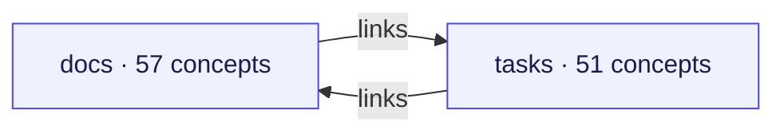
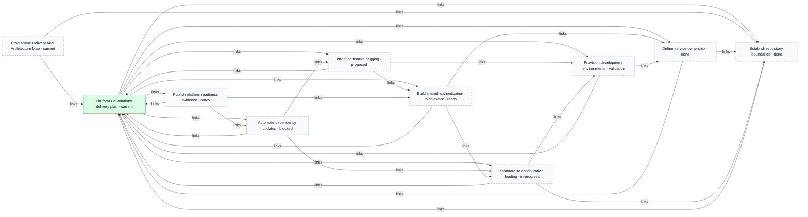
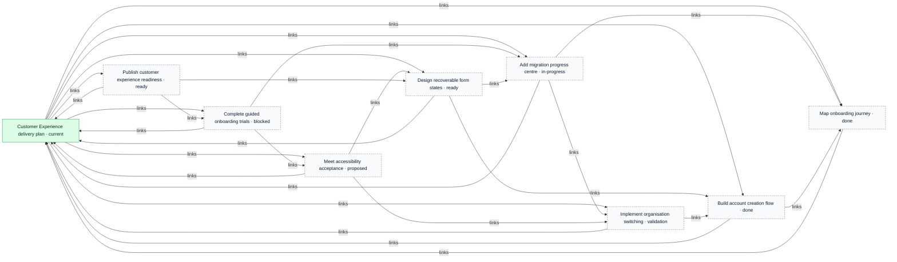
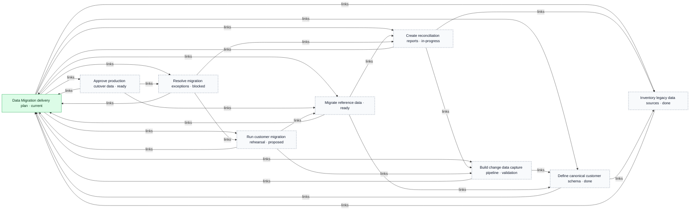
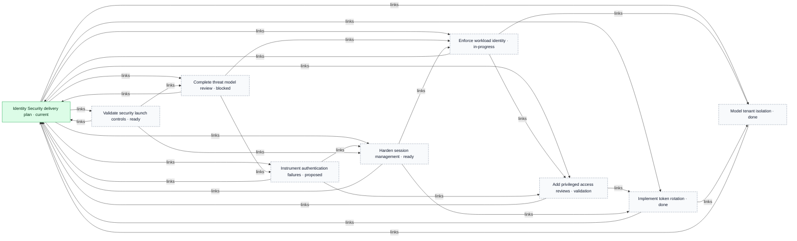
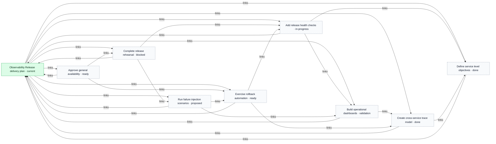
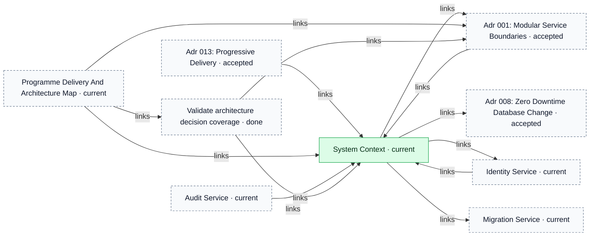

# OKF combined delivery and architecture workspace

> Generated from repository-local OKF records. The Markdown/YAML bundle remains canonical.

Source: `examples/combined-delivery-architecture`

The report separates the connected repository map from detailed component and key-concept views so large bundles remain reviewable.

## Connected-area overview

## Connected component 1

### docs

```mermaid
flowchart LR
    n0["Container Topology · current"]:::knowledge
    n1["Data Platform · current"]:::knowledge
    n2["Deployment Topology · current"]:::knowledge
    n3["Event Backbone · current"]:::knowledge
    n4["Identity Boundary · current"]:::knowledge
    n5["Migration Architecture · current"]:::knowledge
    n6["Observability Model · current"]:::knowledge
    n7["Request Lifecycle · current"]:::knowledge
    n8["Resilience Model · current"]:::knowledge
    n9["Security Architecture · current"]:::knowledge
    n10["System Context · current"]:::knowledge
    n11["Tenant Isolation · current"]:::knowledge
    n12["Customer Experience delivery plan · current"]:::knowledge
    n13["Data Migration delivery plan · current"]:::knowledge
    n14["Adr 001: Modular Service Boundaries · accepted"]:::knowledge
    n15["Adr 002: Versioned Event Envelope · accepted"]:::knowledge
    n16["Adr 003: Oidc Workload Identity · accepted"]:::knowledge
    n17["Adr 004: Tenant Key Partitioning · accepted"]:::knowledge
    n18["Adr 005: Transactional Outbox · accepted"]:::knowledge
    n19["Adr 006: Idempotent Command Handling · accepted"]:::knowledge
    n20["Adr 007: Schema Registry Compatibility · accepted"]:::knowledge
    n21["Adr 008: Zero Downtime Database Change · accepted"]:::knowledge
    n22["Adr 009: Regional Active Passive · accepted"]:::knowledge
    n23["Adr 010: Central Policy Evaluation · accepted"]:::knowledge
    n24["Adr 011: Short Lived Access Tokens · accepted"]:::knowledge
    n25["Adr 012: Immutable Deployment Artefacts · accepted"]:::knowledge
    n26["Adr 013: Progressive Delivery · accepted"]:::knowledge
    n27["Adr 014: Open Telemetry Signals · accepted"]:::knowledge
    n28["Adr 015: Error Budget Release Gates · accepted"]:::knowledge
    n29["Adr 016: Encrypted Event Payloads · accepted"]:::knowledge
    n30["Adr 017: Customer Managed Retention · accepted"]:::knowledge
    n31["Adr 018: Migration Dual Read Window · proposed"]:::knowledge
    n32["Adr 019: Bounded Retry Policies · proposed"]:::knowledge
    n33["Adr 020: Architecture Evidence Records · proposed"]:::knowledge
    n34["Identity Security delivery plan · current"]:::knowledge
    n35["Audit Event Contract · current"]:::knowledge
    n36["Customer Events · current"]:::knowledge
    n37["Identity Events · current"]:::knowledge
    n38["Migration Control Api · current"]:::knowledge
    n39["Public Api · current"]:::knowledge
    n40["Reporting Query Api · current"]:::knowledge
    n41["Observability Release delivery plan · current"]:::knowledge
    n42["Platform Foundations delivery plan · current"]:::knowledge
    n43["Programme Delivery And Architecture Map · current"]:::knowledge
    n44["Availability · current"]:::knowledge
    n45["Operability · current"]:::knowledge
    n46["Performance · current"]:::knowledge
    n47["Recoverability · current"]:::knowledge
    n48["Security · current"]:::knowledge
    n49["Audit Service · current"]:::knowledge
    n50["Customer Service · current"]:::knowledge
    n51["Identity Service · current"]:::knowledge
    n52["Migration Service · current"]:::knowledge
    n53["Notification Service · current"]:::knowledge
    n54["Reporting Service · current"]:::knowledge
    n55["Tenant Service · current"]:::knowledge
    n56["Workflow Service · current"]:::knowledge
    n57["Add migration progress centre · in-progress"]:::boundary
    n58["Add privileged access reviews · validation"]:::boundary
    n59["Add release health checks · in-progress"]:::boundary
    n60["Approve architecture readiness · blocked"]:::boundary
    n61["Approve general availability · ready"]:::boundary
    n62["Approve production cutover data · ready"]:::boundary
    n63["Automate dependency updates · blocked"]:::boundary
    n64["Benchmark critical request paths · ready"]:::boundary
    n65["Build account creation flow · done"]:::boundary
    n66["Build change data capture pipeline · validation"]:::boundary
    n67["Build operational dashboards · validation"]:::boundary
    n68["Build shared authentication middleware · ready"]:::boundary
    n69["Complete guided onboarding trials · blocked"]:::boundary
    n70["Complete release rehearsal · blocked"]:::boundary
    n71["Complete threat model review · blocked"]:::boundary
    n72["Create cross-service trace model · done"]:::boundary
    n73["Create reconciliation reports · in-progress"]:::boundary
    n74["Define canonical customer schema · done"]:::boundary
    n75["Define service level objectives · done"]:::boundary
    n76["Define service ownership · done"]:::boundary
    n77["Design recoverable form states · ready"]:::boundary
    n78["Enforce workload identity · in-progress"]:::boundary
    n79["Establish repository boundaries · done"]:::boundary
    n80["Exercise rollback automation · ready"]:::boundary
    n81["Exercise tenant isolation · in-progress"]:::boundary
    n82["Harden session management · ready"]:::boundary
    n83["Implement organisation switching · validation"]:::boundary
    n84["Implement token rotation · done"]:::boundary
    n85["Instrument authentication failures · proposed"]:::boundary
    n86["Introduce feature flagging · proposed"]:::boundary
    n87["Inventory legacy data sources · done"]:::boundary
    n88["Map onboarding journey · done"]:::boundary
    n89["Meet accessibility acceptance · proposed"]:::boundary
    n90["Migrate reference data · ready"]:::boundary
    n91["Model tenant isolation · done"]:::boundary
    n92["Prototype the event backbone · validation"]:::boundary
    n93["Provision development environments · validation"]:::boundary
    n94["Publish customer experience readiness · ready"]:::boundary
    n95["Publish platform readiness evidence · ready"]:::boundary
    n96["Rehearse regional recovery · proposed"]:::boundary
    n97["Resolve migration exceptions · blocked"]:::boundary
    n98["Run customer migration rehearsal · proposed"]:::boundary
    n99["Run failure injection scenarios · proposed"]:::boundary
    n100["Standardise configuration loading · in-progress"]:::boundary
    n101["Validate architecture decision coverage · done"]:::boundary
    n102["Validate security launch controls · ready"]:::boundary
    n0 -->|links| n15
    n0 -->|links| n22
    n0 -->|links| n55
    n0 -->|links| n56
    n1 -->|links| n19
    n1 -->|links| n26
    n1 -->|links| n53
    n1 -->|links| n51
    n2 -->|links| n21
    n2 -->|links| n28
    n2 -->|links| n54
    n2 -->|links| n50
    n3 -->|links| n20
    n3 -->|links| n27
    n3 -->|links| n49
    n3 -->|links| n55
    n4 -->|links| n17
    n4 -->|links| n24
    n4 -->|links| n52
    n4 -->|links| n49
    n5 -->|links| n25
    n5 -->|links| n32
    n5 -->|links| n52
    n5 -->|links| n49
    n6 -->|links| n23
    n6 -->|links| n30
    n6 -->|links| n55
    n6 -->|links| n56
    n7 -->|links| n16
    n7 -->|links| n23
    n7 -->|links| n50
    n7 -->|links| n53
    n8 -->|links| n22
    n8 -->|links| n29
    n8 -->|links| n51
    n8 -->|links| n52
    n9 -->|links| n24
    n9 -->|links| n31
    n9 -->|links| n50
    n9 -->|links| n53
    n10 -->|links| n14
    n10 -->|links| n21
    n10 -->|links| n51
    n10 -->|links| n52
    n11 -->|links| n18
    n11 -->|links| n25
    n11 -->|links| n56
    n11 -->|links| n54
    n12 -->|links| n88
    n12 -->|links| n65
    n12 -->|links| n83
    n12 -->|links| n57
    n12 -->|links| n77
    n12 -->|links| n89
    n12 -->|links| n69
    n12 -->|links| n94
    n13 -->|links| n87
    n13 -->|links| n74
    n13 -->|links| n66
    n13 -->|links| n73
    n13 -->|links| n90
    n13 -->|links| n98
    n13 -->|links| n97
    n13 -->|links| n62
    n14 -->|links| n10
    n15 -->|links| n0
    n15 -->|links| n14
    n16 -->|links| n7
    n16 -->|links| n15
    n17 -->|links| n4
    n17 -->|links| n16
    n18 -->|links| n11
    n18 -->|links| n17
    n19 -->|links| n1
    n19 -->|links| n18
    n20 -->|links| n3
    n20 -->|links| n19
    n21 -->|links| n2
    n21 -->|links| n20
    n22 -->|links| n8
    n22 -->|links| n21
    n23 -->|links| n6
    n23 -->|links| n22
    n24 -->|links| n9
    n24 -->|links| n23
    n25 -->|links| n5
    n25 -->|links| n24
    n26 -->|links| n10
    n26 -->|links| n25
    n27 -->|links| n0
    n27 -->|links| n26
    n28 -->|links| n7
    n28 -->|links| n27
    n29 -->|links| n4
    n29 -->|links| n28
    n30 -->|links| n11
    n30 -->|links| n29
    n31 -->|links| n1
    n31 -->|links| n30
    n32 -->|links| n3
    n32 -->|links| n31
    n33 -->|links| n2
    n33 -->|links| n32
    n34 -->|links| n91
    n34 -->|links| n84
    n34 -->|links| n58
    n34 -->|links| n78
    n34 -->|links| n82
    n34 -->|links| n85
    n34 -->|links| n71
    n34 -->|links| n102
    n35 -->|links| n56
    n35 -->|links| n49
    n35 -->|links| n27
    n36 -->|links| n50
    n36 -->|links| n56
    n36 -->|links| n21
    n37 -->|links| n55
    n37 -->|links| n52
    n37 -->|links| n18
    n38 -->|links| n52
    n38 -->|links| n53
    n38 -->|links| n24
    n39 -->|links| n51
    n39 -->|links| n50
    n39 -->|links| n15
    n40 -->|links| n53
    n40 -->|links| n54
    n40 -->|links| n30
    n41 -->|links| n75
    n41 -->|links| n72
    n41 -->|links| n67
    n41 -->|links| n59
    n41 -->|links| n80
    n41 -->|links| n99
    n41 -->|links| n70
    n41 -->|links| n61
    n42 -->|links| n79
    n42 -->|links| n76
    n42 -->|links| n93
    n42 -->|links| n100
    n42 -->|links| n68
    n42 -->|links| n86
    n42 -->|links| n63
    n42 -->|links| n95
    n43 -->|links| n10
    n43 -->|links| n14
    n43 -->|links| n42
    n43 -->|links| n79
    n43 -->|links| n101
    n44 -->|links| n11
    n44 -->|links| n16
    n45 -->|links| n8
    n45 -->|links| n32
    n46 -->|links| n3
    n46 -->|links| n24
    n47 -->|links| n2
    n47 -->|links| n28
    n48 -->|links| n1
    n48 -->|links| n20
    n49 -->|links| n10
    n49 -->|links| n39
    n50 -->|links| n11
    n50 -->|links| n36
    n51 -->|links| n10
    n51 -->|links| n39
    n52 -->|links| n3
    n52 -->|links| n38
    n53 -->|links| n9
    n53 -->|links| n40
    n54 -->|links| n7
    n54 -->|links| n37
    n55 -->|links| n7
    n55 -->|links| n37
    n56 -->|links| n8
    n56 -->|links| n35
    n57 -->|links| n83
    n57 -->|links| n88
    n57 -->|links| n12
    n58 -->|links| n84
    n58 -->|links| n34
    n59 -->|links| n67
    n59 -->|links| n75
    n59 -->|links| n41
    n60 -->|links| n96
    n60 -->|links| n9
    n60 -->|links| n29
    n61 -->|links| n70
    n61 -->|links| n80
    n61 -->|links| n41
    n62 -->|links| n97
    n62 -->|links| n90
    n62 -->|links| n13
    n63 -->|links| n86
    n63 -->|links| n100
    n63 -->|links| n42
    n64 -->|links| n81
    n64 -->|links| n3
    n64 -->|links| n23
    n65 -->|links| n88
    n65 -->|links| n12
    n66 -->|links| n74
    n66 -->|links| n13
    n67 -->|links| n72
    n67 -->|links| n41
    n68 -->|links| n100
    n68 -->|links| n76
    n68 -->|links| n42
    n69 -->|links| n89
    n69 -->|links| n57
    n69 -->|links| n12
    n70 -->|links| n99
    n70 -->|links| n59
    n70 -->|links| n41
    n71 -->|links| n85
    n71 -->|links| n78
    n71 -->|links| n34
    n72 -->|links| n75
    n72 -->|links| n41
    n73 -->|links| n66
    n73 -->|links| n87
    n73 -->|links| n13
    n74 -->|links| n87
    n74 -->|links| n13
    n75 -->|links| n94
    n75 -->|links| n41
    n76 -->|links| n79
    n76 -->|links| n42
    n77 -->|links| n57
    n77 -->|links| n65
    n77 -->|links| n12
    n78 -->|links| n58
    n78 -->|links| n91
    n78 -->|links| n34
    n79 -->|links| n42
    n80 -->|links| n59
    n80 -->|links| n72
    n80 -->|links| n41
    n81 -->|links| n92
    n81 -->|links| n11
    n81 -->|links| n20
    n82 -->|links| n78
    n82 -->|links| n84
    n82 -->|links| n34
    n83 -->|links| n65
    n83 -->|links| n12
    n84 -->|links| n91
    n84 -->|links| n34
    n85 -->|links| n82
    n85 -->|links| n58
    n85 -->|links| n34
    n86 -->|links| n68
    n86 -->|links| n93
    n86 -->|links| n42
    n87 -->|links| n102
    n87 -->|links| n13
    n88 -->|links| n62
    n88 -->|links| n12
    n89 -->|links| n77
    n89 -->|links| n83
    n89 -->|links| n12
    n90 -->|links| n73
    n90 -->|links| n74
    n90 -->|links| n13
    n91 -->|links| n95
    n91 -->|links| n34
    n92 -->|links| n101
    n92 -->|links| n7
    n92 -->|links| n17
    n93 -->|links| n76
    n93 -->|links| n42
    n94 -->|links| n69
    n94 -->|links| n77
    n94 -->|links| n12
    n95 -->|links| n63
    n95 -->|links| n68
    n95 -->|links| n42
    n96 -->|links| n64
    n96 -->|links| n8
    n96 -->|links| n26
    n97 -->|links| n98
    n97 -->|links| n73
    n97 -->|links| n13
    n98 -->|links| n90
    n98 -->|links| n66
    n98 -->|links| n13
    n99 -->|links| n80
    n99 -->|links| n67
    n99 -->|links| n41
    n100 -->|links| n93
    n100 -->|links| n79
    n100 -->|links| n42
    n101 -->|links| n10
    n101 -->|links| n14
    n102 -->|links| n71
    n102 -->|links| n82
    n102 -->|links| n34
    classDef task fill:#dbeafe,stroke:#2563eb,color:#172554
    classDef workstream fill:#ede9fe,stroke:#7c3aed,color:#2e1065
    classDef tracker fill:#ffedd5,stroke:#ea580c,color:#431407
    classDef knowledge fill:#dcfce7,stroke:#16a34a,color:#052e16
    classDef boundary fill:#f8fafc,stroke:#64748b,color:#0f172a,stroke-dasharray:4 3
```

### tasks

```mermaid
flowchart LR
    n0["Event Backbone · current"]:::boundary
    n1["Request Lifecycle · current"]:::boundary
    n2["Resilience Model · current"]:::boundary
    n3["Security Architecture · current"]:::boundary
    n4["System Context · current"]:::boundary
    n5["Tenant Isolation · current"]:::boundary
    n6["Customer Experience delivery plan · current"]:::boundary
    n7["Data Migration delivery plan · current"]:::boundary
    n8["Adr 001: Modular Service Boundaries · accepted"]:::boundary
    n9["Adr 004: Tenant Key Partitioning · accepted"]:::boundary
    n10["Adr 007: Schema Registry Compatibility · accepted"]:::boundary
    n11["Adr 010: Central Policy Evaluation · accepted"]:::boundary
    n12["Adr 013: Progressive Delivery · accepted"]:::boundary
    n13["Adr 016: Encrypted Event Payloads · accepted"]:::boundary
    n14["Identity Security delivery plan · current"]:::boundary
    n15["Observability Release delivery plan · current"]:::boundary
    n16["Platform Foundations delivery plan · current"]:::boundary
    n17["Programme Delivery And Architecture Map · current"]:::boundary
    n18["Add migration progress centre · in-progress"]:::task
    n19["Customer Experience coordination · in-progress"]:::workstream
    n20["Add privileged access reviews · validation"]:::task
    n21["Add release health checks · in-progress"]:::task
    n22["Observability Release coordination · in-progress"]:::workstream
    n23["Approve architecture readiness · blocked"]:::task
    n24["Approve general availability · ready"]:::task
    n25["Approve production cutover data · ready"]:::task
    n26["Automate dependency updates · blocked"]:::task
    n27["Benchmark critical request paths · ready"]:::task
    n28["Build account creation flow · done"]:::task
    n29["Build change data capture pipeline · validation"]:::task
    n30["Build operational dashboards · validation"]:::task
    n31["Build shared authentication middleware · ready"]:::task
    n32["Complete guided onboarding trials · blocked"]:::task
    n33["Complete release rehearsal · blocked"]:::task
    n34["Complete threat model review · blocked"]:::task
    n35["Create cross-service trace model · done"]:::task
    n36["Create reconciliation reports · in-progress"]:::task
    n37["Data Migration coordination · in-progress"]:::workstream
    n38["Define canonical customer schema · done"]:::task
    n39["Define service level objectives · done"]:::task
    n40["Define service ownership · done"]:::task
    n41["Design recoverable form states · ready"]:::task
    n42["Enforce workload identity · in-progress"]:::task
    n43["Identity Security coordination · in-progress"]:::workstream
    n44["Establish repository boundaries · done"]:::task
    n45["Exercise rollback automation · ready"]:::task
    n46["Exercise tenant isolation · in-progress"]:::task
    n47["Harden session management · ready"]:::task
    n48["Implement organisation switching · validation"]:::task
    n49["Implement token rotation · done"]:::task
    n50["Instrument authentication failures · proposed"]:::task
    n51["Introduce feature flagging · proposed"]:::task
    n52["Inventory legacy data sources · done"]:::task
    n53["Map onboarding journey · done"]:::task
    n54["Meet accessibility acceptance · proposed"]:::task
    n55["Migrate reference data · ready"]:::task
    n56["Model tenant isolation · done"]:::task
    n57["Prototype the event backbone · validation"]:::task
    n58["Provision development environments · validation"]:::task
    n59["Publish customer experience readiness · ready"]:::task
    n60["Publish platform readiness evidence · ready"]:::task
    n61["Rehearse regional recovery · proposed"]:::task
    n62["Resolve migration exceptions · blocked"]:::task
    n63["Run customer migration rehearsal · proposed"]:::task
    n64["Run failure injection scenarios · proposed"]:::task
    n65["Standardise configuration loading · in-progress"]:::task
    n66["Platform Foundations coordination · in-progress"]:::workstream
    n67["Validate architecture decision coverage · done"]:::task
    n68["Validate security launch controls · ready"]:::task
    n0 -->|links| n10
    n1 -->|links| n11
    n2 -->|links| n13
    n4 -->|links| n8
    n6 -->|links| n53
    n6 -->|links| n28
    n6 -->|links| n48
    n6 -->|links| n18
    n6 -->|links| n41
    n6 -->|links| n54
    n6 -->|links| n32
    n6 -->|links| n59
    n7 -->|links| n52
    n7 -->|links| n38
    n7 -->|links| n29
    n7 -->|links| n36
    n7 -->|links| n55
    n7 -->|links| n63
    n7 -->|links| n62
    n7 -->|links| n25
    n8 -->|links| n4
    n10 -->|links| n0
    n12 -->|links| n4
    n14 -->|links| n56
    n14 -->|links| n49
    n14 -->|links| n20
    n14 -->|links| n42
    n14 -->|links| n47
    n14 -->|links| n50
    n14 -->|links| n34
    n14 -->|links| n68
    n15 -->|links| n39
    n15 -->|links| n35
    n15 -->|links| n30
    n15 -->|links| n21
    n15 -->|links| n45
    n15 -->|links| n64
    n15 -->|links| n33
    n15 -->|links| n24
    n16 -->|links| n44
    n16 -->|links| n40
    n16 -->|links| n58
    n16 -->|links| n65
    n16 -->|links| n31
    n16 -->|links| n51
    n16 -->|links| n26
    n16 -->|links| n60
    n17 -->|links| n4
    n17 -->|links| n8
    n17 -->|links| n16
    n17 -->|links| n44
    n17 -->|links| n67
    n18 -->|links| n48
    n18 -->|links| n53
    n18 -->|links| n6
    n19 -->|links| n28
    n19 -->|links| n48
    n19 -->|links| n41
    n19 -->|links| n54
    n19 -->|links| n32
    n19 -->|workstream| n18
    n20 -->|links| n49
    n20 -->|links| n14
    n21 -->|links| n30
    n21 -->|links| n39
    n21 -->|links| n15
    n22 -->|links| n35
    n22 -->|links| n30
    n22 -->|links| n45
    n22 -->|links| n64
    n22 -->|links| n33
    n22 -->|workstream| n21
    n23 -->|links| n61
    n23 -->|links| n3
    n23 -->|links| n13
    n24 -->|links| n33
    n24 -->|links| n45
    n24 -->|links| n15
    n25 -->|links| n62
    n25 -->|links| n55
    n25 -->|links| n7
    n26 -->|links| n51
    n26 -->|links| n65
    n26 -->|links| n16
    n27 -->|links| n46
    n27 -->|links| n0
    n27 -->|links| n11
    n28 -->|links| n53
    n28 -->|links| n6
    n29 -->|links| n38
    n29 -->|links| n7
    n30 -->|links| n35
    n30 -->|links| n15
    n31 -->|links| n65
    n31 -->|links| n40
    n31 -->|links| n16
    n32 -->|links| n54
    n32 -->|links| n18
    n32 -->|links| n6
    n33 -->|links| n64
    n33 -->|links| n21
    n33 -->|links| n15
    n34 -->|links| n50
    n34 -->|links| n42
    n34 -->|links| n14
    n35 -->|links| n39
    n35 -->|links| n15
    n36 -->|links| n29
    n36 -->|links| n52
    n36 -->|links| n7
    n37 -->|links| n38
    n37 -->|links| n29
    n37 -->|links| n55
    n37 -->|links| n63
    n37 -->|links| n62
    n37 -->|workstream| n36
    n38 -->|links| n52
    n38 -->|links| n7
    n39 -->|links| n59
    n39 -->|links| n15
    n40 -->|links| n44
    n40 -->|links| n16
    n41 -->|links| n18
    n41 -->|links| n28
    n41 -->|links| n6
    n42 -->|links| n20
    n42 -->|links| n56
    n42 -->|links| n14
    n43 -->|links| n49
    n43 -->|links| n20
    n43 -->|links| n47
    n43 -->|links| n50
    n43 -->|links| n34
    n43 -->|workstream| n42
    n44 -->|links| n16
    n45 -->|links| n21
    n45 -->|links| n35
    n45 -->|links| n15
    n46 -->|links| n57
    n46 -->|links| n5
    n46 -->|links| n10
    n47 -->|links| n42
    n47 -->|links| n49
    n47 -->|links| n14
    n48 -->|links| n28
    n48 -->|links| n6
    n49 -->|links| n56
    n49 -->|links| n14
    n50 -->|links| n47
    n50 -->|links| n20
    n50 -->|links| n14
    n51 -->|links| n31
    n51 -->|links| n58
    n51 -->|links| n16
    n52 -->|links| n68
    n52 -->|links| n7
    n53 -->|links| n25
    n53 -->|links| n6
    n54 -->|links| n41
    n54 -->|links| n48
    n54 -->|links| n6
    n55 -->|links| n36
    n55 -->|links| n38
    n55 -->|links| n7
    n56 -->|links| n60
    n56 -->|links| n14
    n57 -->|links| n67
    n57 -->|links| n1
    n57 -->|links| n9
    n58 -->|links| n40
    n58 -->|links| n16
    n59 -->|links| n32
    n59 -->|links| n41
    n59 -->|links| n6
    n60 -->|links| n26
    n60 -->|links| n31
    n60 -->|links| n16
    n61 -->|links| n27
    n61 -->|links| n2
    n61 -->|links| n12
    n62 -->|links| n63
    n62 -->|links| n36
    n62 -->|links| n7
    n63 -->|links| n55
    n63 -->|links| n29
    n63 -->|links| n7
    n64 -->|links| n45
    n64 -->|links| n30
    n64 -->|links| n15
    n65 -->|links| n58
    n65 -->|links| n44
    n65 -->|links| n16
    n66 -->|links| n40
    n66 -->|links| n58
    n66 -->|links| n31
    n66 -->|links| n51
    n66 -->|links| n26
    n66 -->|workstream| n65
    n67 -->|links| n4
    n67 -->|links| n8
    n68 -->|links| n34
    n68 -->|links| n47
    n68 -->|links| n14
    classDef task fill:#dbeafe,stroke:#2563eb,color:#172554
    classDef workstream fill:#ede9fe,stroke:#7c3aed,color:#2e1065
    classDef tracker fill:#ffedd5,stroke:#ea580c,color:#431407
    classDef knowledge fill:#dcfce7,stroke:#16a34a,color:#052e16
    classDef boundary fill:#f8fafc,stroke:#64748b,color:#0f172a,stroke-dasharray:4 3
```

## Key concept neighbourhoods

### Platform Foundations delivery plan

### Customer Experience delivery plan

### Data Migration delivery plan

### Identity Security delivery plan

### Observability Release delivery plan

### System Context

## Legend

- Blue: task
- Purple: workstream
- Orange: tracker profile
- Green: durable knowledge
- Dashed neutral nodes: neighbouring context repeated from another area or key-concept view
- Time references: edges to addressable `Task.time[]` fragments
- Arrows: structured relationships or repository-local Markdown links
