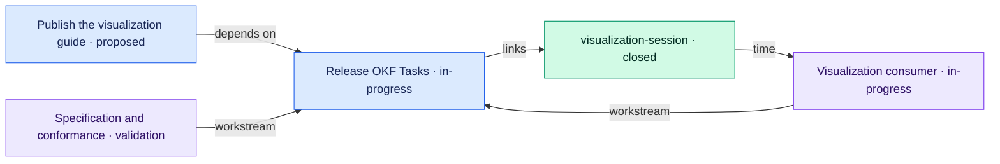

# OKF Tasks visualization example

> Generated from repository-local OKF records. The Markdown/YAML bundle remains canonical.

Source: `examples/visualization/tasks`

## Legend

- Blue: task
- Purple: workstream
- Green: time entry
- Arrows: structured relationships or repository-local Markdown links
