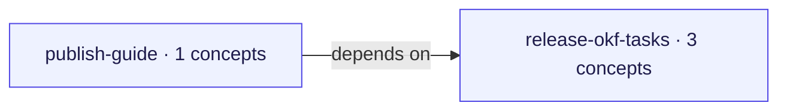
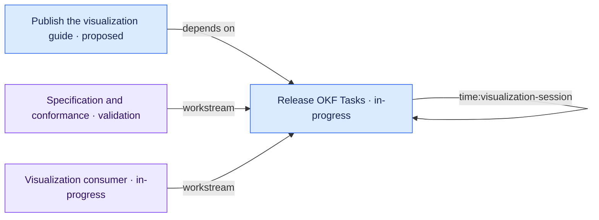
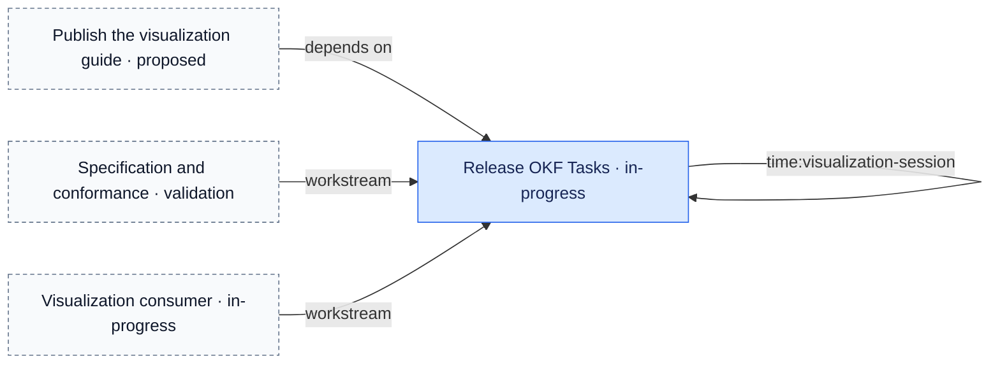

# OKF Tasks visualization example

> Generated from repository-local OKF records. The Markdown/YAML bundle remains canonical.

Source: `examples/visualization/tasks`

The report separates the connected repository map from detailed component and key-concept views so large bundles remain reviewable.

## Connected-area overview

## Connected component 1

## Key concept neighbourhoods

### Release OKF Tasks

## Unconnected concepts

These records are listed instead of receiving equal visual weight in the connected graph.

- **trackers/github-main** — `trackers/github-main` (Tracker Profile)

## Legend

- Blue: task
- Purple: workstream
- Orange: tracker profile
- Green: durable knowledge
- Dashed neutral nodes: neighbouring context repeated from another area or key-concept view
- Time references: edges to addressable `Task.time[]` fragments
- Arrows: structured relationships or repository-local Markdown links
