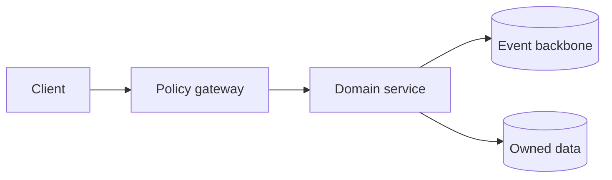

# Observability Model

## Purpose and boundaries

This document defines the responsibilities, trust boundaries, and collaboration model for observability model. It is intentionally detailed enough to exercise the Reader while remaining connected to the wider decision graph.

## Component model

## Runtime flow

1. The caller presents a scoped identity and an idempotency key.
2. Policy is evaluated before domain state is loaded.
3. The domain service commits state and an event atomically.
4. Consumers process the versioned envelope and publish trace evidence.

## Failure handling

- Reject ambiguous tenant context before work begins.
- Bound retries and route exhausted work to reviewable recovery queues.
- Preserve correlation identifiers across synchronous and asynchronous boundaries.

## Security and operability

| Concern | Design response |
| --- | --- |
| Least privilege | Workload identities are scoped per service. |
| Auditability | Security-sensitive transitions emit immutable audit events. |
| Recovery | Replays remain idempotent and observable. |
| Drift | Linked decisions carry explicit last-meaningful-change timestamps. |

## Related decisions and components

- [ADR 010: Central Policy Evaluation](../decisions/adr-010-central-policy-evaluation.md)
- [ADR 017: Customer Managed Retention](../decisions/adr-017-customer-managed-retention.md)
- [Tenant Service](../services/tenant-service.md)
- [Workflow Service](../services/workflow-service.md)
